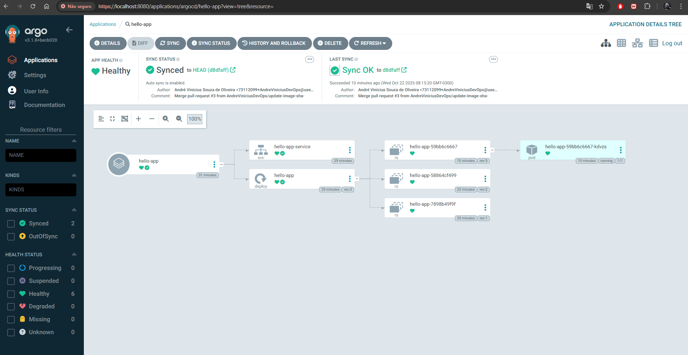
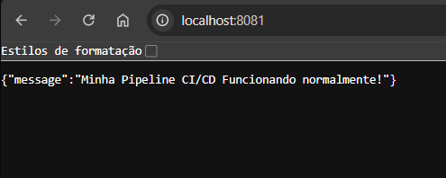

# Projeto CI/CD com GitHub Actions: FastAPI, Docker, ArgoCD e Kubernetes

Este projeto implementa um pipeline completo de CI/CD (Integração Contínua e Entrega Contínua) utilizando um fluxo de trabalho GitOps.

## 🎯 Objetivo

Automatizar o ciclo completo de desenvolvimento, build, deploy e execução de uma aplicação FastAPI simples. Para isso, utilizamos GitHub Actions para CI, Docker Hub como registro de contêineres, e ArgoCD para entrega contínua (CD) em um cluster Kubernetes local (Rancher Desktop).

## 🛠️ Tecnologias Utilizadas

* **Aplicação:** Python (FastAPI)
* **Containerização:** Docker
* **Registro de Imagem:** Docker Hub
* **CI (Build & Push):** GitHub Actions
* **CD (Deploy):** ArgoCD (com GitOps)
* **Cluster:** Kubernetes (via Rancher Desktop)
* **Manifestos:** Kustomize (yaml)

##  Fluxo do Pipeline

1.  **Desenvolvedor** faz `git push` do código da aplicação (`hello-app`).
2.  **GitHub Actions (CI)** é acionado:
    * Constrói (build) a imagem Docker.
    * Envia (push) a imagem para o Docker Hub com uma tag única (SHA do commit).
    * Cria um Pull Request (PR) no repositório de manifestos (`hello-manifests`), atualizando a tag da imagem no `deployment.yaml`.
3.  **Desenvolvedor (ou SRE)** revisa e aprova (merge) o PR.
4.  **ArgoCD (CD)** detecta a mudança no repositório `hello-manifests`.
5.  **ArgoCD** sincroniza o cluster Kubernetes com o estado desejado, atualizando a aplicação para a nova versão.

---

## 📋 Pré-requisitos

Antes de começar, garanta que você possui as seguintes ferramentas e contas configuradas:

* [ ] **Conta no GitHub** (para os repositórios).
* [ ] **Conta no Docker Hub** e um **Token de Acesso** com permissões de **Leitura e Gravação**.
* [ ] **Rancher Desktop** instalado e com Kubernetes habilitado.
* [ ] **Git** instalado na sua máquina local.
* [ ] **Python 3** e **Docker Desktop** instalados.
* [ ] **kubectl** configurado para se conectar ao seu cluster (verifique com `kubectl get nodes`).
* [ ] **ArgoCD** instalado no seu cluster local (siga o guia "Getting Started" do ArgoCD).

---

## 🚀 Passo a Passo da Implementação

Dividimos o projeto em 6 etapas principais.

### Etapa 1: Criar a Aplicação FastAPI

Primeiro, criamos nossa aplicação simples e seu Dockerfile.

1.  Crie um novo repositório público no GitHub chamado `hello-app`.
2.  Clone o repositório para sua máquina local.
3.  Dentro da pasta, crie os três arquivos a seguir:

    **`main.py`** (Nossa API):
    ```python
    from fastapi import FastAPI
    
    app = FastAPI()
    
    @app.get("/")
    async def root():
        return {"message": "Hello World"}
    ```

    **`requirements.txt`** (Dependências):
    ```
    fastapi
    uvicorn
    ```

    **`Dockerfile`** (Instruções de build da imagem):
    ```dockerfile
    # Usar uma imagem base oficial do Python
    FROM python:3.9-slim
    
    # Definir o diretório de trabalho no container
    WORKDIR /app
    
    # Copiar o arquivo de requisitos e instalar
    COPY requirements.txt .
    RUN pip install --no-cache-dir -r requirements.txt
    
    # Copiar o código da aplicação
    COPY main.py .
    
    # Expor a porta que o uvicorn usará
    EXPOSE 8000
    
    # Comando para rodar a aplicação
    CMD ["uvicorn", "main:app", "--host", "0.0.0.0", "--port", "8000"]
    ```
4.  Faça o commit e envie esses três arquivos para o repositório `hello-app`.

### Etapa 2: Criar os Manifestos do Kubernetes

Agora, criamos o repositório que servirá como a "fonte da verdade" (GitOps) para o ArgoCD.

1.  Crie um **segundo** repositório público no GitHub chamado `hello-manifests`.
2.  Clone este novo repositório para sua máquina.
3.  Dentro da pasta, crie os dois manifestos YAML a seguir:

    **`deployment.yaml`** (Como rodar nossa aplicação):
    ```yaml
    apiVersion: apps/v1
    kind: Deployment
    metadata:
      name: hello-app
    spec:
      replicas: 1
      selector:
        matchLabels:
          app: hello-app
      template:
        metadata:
          labels:
            app: hello-app
        spec:
          containers:
          - name: hello-app
            # IMPORTANTE: Use seu usuário do Docker Hub
            # Esta linha será atualizada automaticamente pela CI
            image: seu-usuario-dockerhub/hello-app:latest 
            ports:
            - containerPort: 8000
    ```
    * **Atenção:** Lembre-se de trocar `seu-usuario-dockerhub` pelo seu nome de usuário real do Docker Hub.

    **`service.yaml`** (Como expor nossa aplicação no cluster):
    ```yaml
    apiVersion: v1
    kind: Service
    metadata:
      name: hello-app-service
    spec:
      selector:
        app: hello-app
      ports:
        - protocol: TCP
          port: 80 # Porta interna do cluster
          targetPort: 8000 # Porta do container (definida no Dockerfile)
    ```
4.  Faça o commit e envie esses dois arquivos para o repositório `hello-manifests`.

### Etapa 3: Configurar Segredos e Chaves

Esta é a etapa mais crítica para fazer a comunicação entre os repositórios e serviços funcionar.

#### 1. Segredos do Docker Hub (em `hello-app`)

Para o GitHub Actions conseguir enviar imagens para o Docker Hub, ele precisa de credenciais.

1.  No **Docker Hub**, vá em "Account Settings" > "Security" > "New Access Token".
2.  Crie um token com permissões de **Read & Write**.
3.  No repositório `hello-app` no **GitHub**, vá em "Settings" > "Secrets and variables" > "Actions".
4.  Crie dois **"New repository secrets"**:
    * `DOCKER_USERNAME`: Seu nome de usuário do Docker Hub.
    * `DOCKER_PASSWORD`: O token de acesso que você acabou de gerar.

#### 2. Chave SSH (Deploy Key) (entre `hello-app` e `hello-manifests`)

Para o `hello-app` conseguir *escrever* no `hello-manifests` (criar o PR), usamos uma chave SSH.

1.  **No seu terminal local**, gere um novo par de chaves:
    ```bash
    ssh-keygen -t rsa -b 4096 -f hello-app-deploy-key -N ""
    ```
2.  Isso cria dois arquivos: `hello-app-deploy-key` (privada) e `hello-app-deploy-key.pub` (pública).
3.  **No repositório `hello-app` (GitHub)**:
    * Vá em "Settings" > "Secrets and variables" > "Actions".
    * Crie um novo segredo: `SSH_PRIVATE_KEY`.
    * Cole o conteúdo **inteiro** do arquivo `hello-app-deploy-key` (a chave privada).
4.  **No repositório `hello-manifests` (GitHub)**:
    * Vá em "Settings" > "Deploy keys" > "Add deploy key".
    * **Title:** `hello-app-ci`
    * **Key:** Cole o conteúdo do arquivo `hello-app-deploy-key.pub` (a chave pública).
    * **Marque a caixa "Allow write access"**.

#### 3. Personal Access Token (PAT) (em `hello-app`)

Para o GitHub Actions *criar o Pull Request* com sucesso, ele precisa de um token com permissão de `repo`.

1.  No seu **GitHub**, vá em "Settings" (no seu perfil) > "Developer settings" > "Personal access tokens" > "Tokens (classic)".
2.  Clique em "Generate new token (classic)".
3.  Dê um nome e **marque o escopo `repo`**.
4.  Gere e copie o token (que começa com `ghp_...`).
5.  **No repositório `hello-app` (GitHub)**:
    * Vá em "Settings" > "Secrets and variables" > "Actions".
    * Crie um novo segredo: `PAT_TOKEN`.
    * Cole o token `ghp_...` que você acabou de gerar.

### Etapa 4: Criar o Workflow de CI/CD (GitHub Actions)

Agora, vamos criar a automação no repositório `hello-app`.

1.  Na pasta do `hello-app` no seu computador, crie a estrutura de pastas: `.github/workflows/`.
2.  Dentro de `workflows`, crie o arquivo `main.yaml`:

    **`.github/workflows/main.yaml`**
    ```yaml
    name: CI-CD Pipeline - Hello App

    # Gatilho: Rodar sempre que houver um push na branch 'main'
    on:
      push:
        branches:
          - "main"

    jobs:
      build_and_push:
        runs-on: ubuntu-latest
        
        steps:
          # 1. Faz o checkout do código do app (hello-app)
          - name: Checkout repository
            uses: actions/checkout@v3

          # 2. Configura o Docker Buildx
          - name: Set up Docker Buildx
            uses: docker/setup-buildx-action@v2

          # 3. Faz login no Docker Hub
          - name: Login to Docker Hub
            uses: docker/login-action@v2
            with:
              username: ${{ secrets.DOCKER_USERNAME }}
              password: ${{ secrets.DOCKER_PASSWORD }}
              
          # 4. Gera a tag da imagem (SHA curto do commit)
          - name: Generate Image Tag
            id: generate_tag
            run: echo "IMAGE_TAG=sha-$(echo $GITHUB_SHA | cut -c1-7)" >> $GITHUB_ENV

          # 5. Builda e envia a imagem para o Docker Hub
          - name: Build and push
            uses: docker/build-push-action@v4
            with:
              context: .
              push: true
              tags: ${{ secrets.DOCKER_USERNAME }}/hello-app:${{ env.IMAGE_TAG }}
              # Exemplo: andreviniciusdevops/hello-app:sha-1234567
              
      update_manifest:
        # Este job só roda depois que o 'build_and_push' terminar
        needs: build_and_push
        runs-on: ubuntu-latest
        
        steps:
          # 1. Faz o checkout do repositório de manifestos (hello-manifests)
          - name: Checkout manifests repository
            uses: actions/checkout@v3
            with:
              # MUDE AQUI para seu usuário/repo de manifestos
              repository: seu-usuario-github/hello-manifests 
              ssh-key: ${{ secrets.SSH_PRIVATE_KEY }}
              ref: main

          # 2. Gera a nova tag (precisamos dela de novo aqui)
          - name: Generate Image Tag
            id: generate_tag
            run: echo "IMAGE_TAG=sha-$(echo $GITHUB_SHA | cut -c1-7)" >> $GITHUB_ENV

          # 3. Atualiza o arquivo deployment.yaml
          - name: Update Kubernetes manifest
            run: |
              # Use 'sed' para encontrar a linha da imagem e substituir a tag
              # MUDE 'seu-usuario-dockerhub' para seu usuário
              # MUDE 'deployment.yaml' se seu arquivo tiver outro nome
              sed -i "s|image: ${{ secrets.DOCKER_USERNAME }}/hello-app.*|image: ${{ secrets.DOCKER_USERNAME }}/hello-app:${{ env.IMAGE_TAG }}|g" deployment.yaml

          # 4. Cria um Pull Request com a alteração
          - name: Create Pull Request
            uses: peter-evans/create-pull-request@v5
            with:
              # Usamos o PAT_TOKEN aqui para ter permissão
              token: ${{ secrets.PAT_TOKEN }} 
              commit-message: "Atualiza imagem para ${{ env.IMAGE_TAG }}"
              title: "Atualização Automática de Imagem para ${{ env.IMAGE_TAG }}"
              body: "Pipeline de CI/CD atualizou a imagem da aplicação para a versão `${{ env.IMAGE_TAG }}`."
              branch: "update-image-${{ env.IMAGE_TAG }}"
              base: "main"
    ```
3.  **Importante:** Ajuste os nomes de usuário (`seu-usuario-github`, `seu-usuario-dockerhub`) e o nome do arquivo (`deployment.yaml`) no código acima.
4.  Faça o commit e envie o arquivo `.github/workflows/main.yaml` para o repositório `hello-app`.
5.  Isso acionará o workflow. Vá até a aba "Actions" do `hello-app` e verifique se ele roda com sucesso. Ao final, ele deve ter criado um Pull Request no repositório `hello-manifests`.

### Etapa 5: Configurar o ArgoCD (Entrega Contínua)

Agora, vamos dizer ao ArgoCD para monitorar nosso repositório de manifestos.

1.  **Acesse a UI do ArgoCD:**
    * No terminal, exponha a UI do ArgoCD:
        ```bash
        kubectl port-forward svc/argocd-server -n argocd 8080:443
        ```
    * Acesse `https://localhost:8080` (ignore o aviso de certificado).
2.  **Faça Login:**
    * Usuário: `admin`
    * Senha (execute no terminal):
        ```bash
        kubectl -n argocd get secret argocd-initial-admin-secret -o jsonpath="{.data.password}" | base64 -d
        ```
3.  **Crie a Aplicação:**
    * Na UI do ArgoCD, clique em **"+ NEW APP"**.
    * **Application Name:** `hello-app`
    * **Project:** `default`
    * **Sync Policy:** `Automatic` (para aplicar mudanças automaticamente após o merge).
    * **Repository URL:** `https://github.com/SEU-USUARIO/hello-manifests.git`
    * **Revision:** `HEAD`
    * **Path:** `.`
    * **Destination Cluster URL:** `https://kubernetes.default.svc`
    * **Namespace:** `default`
4.  Clique em **"CREATE"**.
5.  O ArgoCD fará a sincronização inicial. É esperado que ele falhe (o pod ficará em `ImagePullBackOff`), pois a imagem `:latest` (do nosso commit inicial) não existe.

### Etapa 6: Testar o Fluxo Completo

Agora, vamos fazer o primeiro deploy real e testar todo o fluxo.

#### 1. Primeiro Deploy (GitOps Merge)

1.  No repositório `hello-manifests`, vá em **"Pull requests"**.
2.  Você verá o PR aberto pela sua pipeline (Etapa 4).
3.  **Faça o Merge** desse Pull Request.
4.  Volte para o **ArgoCD**. Como a política de Sync é `Automatic`, ele deve detectar a mudança na branch `main`, sincronizar e aplicar o novo manifesto (com a tag `sha-...` correta).
5.  O status do `hello-app` no ArgoCD deve mudar para **"Healthy"** e **"Synced"**.

#### 2. Acessar a Aplicação

1.  No seu terminal, exponha o *serviço* da aplicação (use uma porta diferente da do ArgoCD, como `8081`):
    ```bash
    kubectl port-forward service/hello-app-service 8081:80
    ```
2.  Acesse no navegador: `http://localhost:8081/`
3.  Você deve ver a mensagem: `{"message": "Hello World"}`.

#### 3. Testar a Mudança (O Ciclo Completo)

Vamos provar que o pipeline funciona de ponta a ponta.

1.  No repositório `hello-app`, abra o `main.py` e mude a mensagem:
    ```python
    return {"message": "Meu Pipeline CI/CD funciona!"}
    ```
2.  Faça o commit e o push:
    ```bash
    git add .
    git commit -m "Testa o fluxo CI/CD completo"
    git push origin main
    ```
3.  **Aguarde:**
    * O GitHub Actions vai rodar (novo build, novo push).
    * Um **novo** Pull Request será aberto no `hello-manifests`.
4.  **Aja como o SRE:** Vá ao `hello-manifests` e faça o **merge** do *novo* PR.
5.  **Observe o ArgoCD:** O ArgoCD detectará a mudança, o status ficará "Progressing" e, em seguida, "Healthy" novamente.
6.  **Verifique o Resultado:**
    * Atualize a página no seu navegador: `http://localhost:8081/`.
    * A nova mensagem `{"message": "Meu Pipeline CI/CD funciona!"}` deve aparecer.
    



**Parabéns, você construiu um pipeline CI/CD completo com GitOps, utilizando as mais avançadas tecnologias do mercado e compreendendo e aprendendo todo o ciclo de uma aplicação DevOps, e DevSecOps!**
